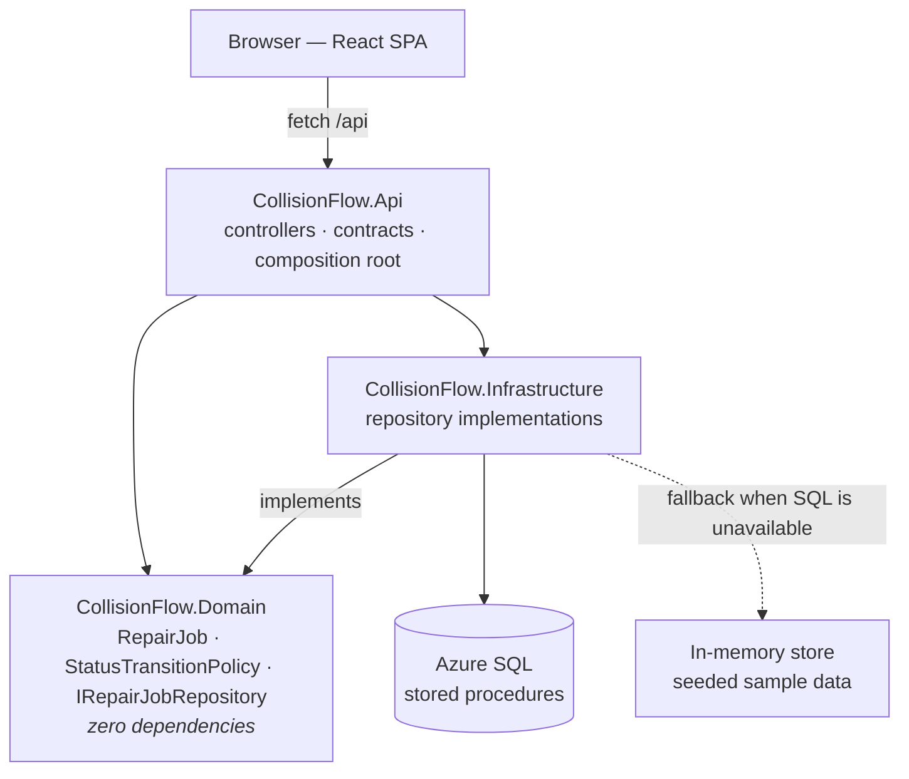

# CollisionFlow

**Repair Status Tracker** — take-home project for Crash Champions.

A single-page application for moving vehicle repair orders through a collision center's
workflow. ASP.NET Core 8 Web API + React 19 SPA, shipped as one deployable.

> **Live demo:** _pending deployment_ · **API reference:** `/swagger`

---

## Contents

- [Scope: what to review](#scope-what-to-review)
- [Quick start](#quick-start)
- [The workflow](#the-workflow)
- [Architecture](#architecture)
- [Code tour](#code-tour)
- [Design decisions](#design-decisions)
- [Testing](#testing)
- [Assumptions](#assumptions)
- [AI usage](#ai-usage)
- [With more time](#with-more-time)

---

## Scope: what to review

The brief asked for a 1–2 hour exercise. I built that first and tagged it, then kept going
against the specifics of the job description. Both are in this repository.

| | Assignment scope | Extended |
|---|---|---|
| Git ref | `v1.0-assignment-scope` | `main` |
| Contains | Repair order list, status updates, workflow validation, unit tests | _(in progress — see Roadmap)_ |

If you only have ten minutes, review the tag. I scoped and delivered the ask before
extending it, and I'd rather show you the additional work than describe it in an interview.

Crash Champions already offers customers repair status tracking on the public site. I built
this as the shop-side counterpart: the board a service advisor works from.

---

## Quick start

Requires the **.NET 8 SDK** and **Node 20+**.

```bash
# Terminal 1 — API on http://localhost:5210
dotnet run --project src/CollisionFlow.Api

# Terminal 2 — SPA on http://localhost:5173, proxying /api to the API
cd src/collisionflow.web
npm install
npm run dev
```

Open <http://localhost:5173>.

To run everything from the API alone, build the SPA into `wwwroot` first:

```bash
cd src/collisionflow.web && npm run build
dotnet run --project src/CollisionFlow.Api      # SPA + API together on :5210
```

---

## The workflow

Six approved statuses. The transitions between them are **not** a straight line, because
two shop realities shape the graph:

```
Received ──▶ In Progress ⇄ Waiting on Parts
                 │  ▲
                 ▼  │  (failed QC → rework)
           Quality Check ──▶ Ready for Pickup ──▶ Completed
```

- **Parts holds are reversible.** A job waiting on a back-ordered bumper resumes when the
  part lands; it does not restart.
- **Quality Check can fail.** Work that doesn't pass goes back for rework, not forward to
  the customer. Modeling that loop is the difference between a workflow and a progress bar.
- **Completed is terminal.** Reopening a closed repair order is a *supplement* in the real
  business process, not an edit to history.
- **`Received → Waiting on Parts` is deliberate.** Parts are frequently ordered before
  teardown begins.

### Where these rules live

The legal transitions are held as a **set of edges**, not as `if` statements — one
definition with four consumers:

| Consumer | Uses it to |
|---|---|
| `dbo.usp_RepairJob_UpdateStatus` | reject an illegal move inside the transaction |
| `RepairJob.ChangeStatus` | guarantee the entity can never hold an illegal state |
| `RepairJobsController` | return a 422 that lists the legal alternatives |
| `JobRow.tsx` | render only the options that would succeed |

None of them owns a private copy, so none of them can drift. Adding a status becomes a data
change rather than a redeploy.

---

## Architecture



The arrow from `Infrastructure` **to** `Domain` is the point. `IRepairJobRepository` is
declared in the domain and implemented in infrastructure, so storage depends on the business
rather than the other way around. `CollisionFlow.Api` is the composition root — the only
project permitted to know about both sides.

```
src/
  CollisionFlow.Domain/          business rules — no package references at all
  CollisionFlow.Infrastructure/  storage; implements interfaces the domain declares
  CollisionFlow.Api/             HTTP surface + composition root; hosts the built SPA
  collisionflow.web/             React + TypeScript, builds into the API's wwwroot
tests/
  CollisionFlow.Domain.Tests/    61 tests, including all 36 status-pair combinations
db/                              SQL schema, seed and stored procedures
```

### A status change, end to end

```mermaid
sequenceDiagram
    participant U as Service advisor
    participant W as React SPA
    participant C as RepairJobsController
    participant P as StatusTransitionPolicy
    participant R as IRepairJobRepository
    participant J as RepairJob

    U->>W: picks "Ready for Pickup", clicks Update
    Note over W: the select only ever offered<br/>job.allowedTransitions
    W->>C: PUT /api/repair-jobs/{id}/status
    C->>R: GetByIdAsync(id)
    R-->>C: RepairJob
    C->>P: IsAllowed(QualityCheck, ReadyForPickup)
    alt rejected
        P-->>C: false
        C-->>W: 422 + allowedTransitions
        W->>U: explains what IS permitted
    else permitted
        P-->>C: true
        C->>R: UpdateStatusAsync(id, ReadyForPickup)
        R->>J: ChangeStatus(status, policy, now)
        Note over J: checks the policy again —<br/>defense in depth, not flow control
        J-->>R: true
        R-->>C: updated RepairJob
        C-->>W: 200 + job with new allowedTransitions
        W->>U: row updates; aria-live announces the change
    end
```

### Request pipeline

```
UseExceptionHandler                → DomainException becomes RFC 7807, not a 500
Swagger (development only)
UseHttpsRedirection
UseDefaultFiles / UseStaticFiles   → the built SPA from wwwroot
MapControllers                     → /api/*
MapFallbackToFile("index.html")    → client-side routes
```

---

## Code tour

Practices worth pointing at, anchored to real code rather than described in the abstract.

**The domain cannot reach the database.**
`CollisionFlow.Domain.csproj` has no `PackageReference` elements. None. That emptiness is
the design: business rules that *cannot* reference infrastructure cannot accidentally depend
on it.

**Illegal states are unrepresentable, not merely discouraged.**
`RepairJob.Status` has a private setter, and the only way to change it is `ChangeStatus`,
which consults the policy first. There is no code path that sets a status without asking,
because there is no setter to call.

**An enum is not a constraint.**
`(RepairStatus)99` compiles, casts and assigns without complaint — the type system does not
enforce enum membership at runtime. `RepairJob.RequireDefinedStatus` calls `Enum.IsDefined`,
which is what actually enforces "only approved statuses can be used." There's a test named
after exactly that.

**Two factories, deliberately.**
`RepairJob.Open()` enforces the rules for *new* work (it always starts at `Received`).
`Rehydrate()` replays what already happened, so it must accept any status the store
legitimately holds. Collapsing them would mean either weakening creation or being unable to
load a finished job.

**Errors that tell you what you *can* do.**
`RepairJobsController.InvalidTransitionProblem` returns problem details carrying
`currentStatus`, `requestedStatus` and **`allowedTransitions`**. An error that only says
"no" forces the client to guess, or to ship its own copy of a rule it doesn't own.

**Idempotency is a design property, not a comment.**
`ChangeStatus` returns `false` and changes nothing when the requested status equals the
current one — including leaving `UpdatedUtc` alone, so a no-op never looks like activity in
the audit trail. That's what makes `PUT` genuinely safe to retry after a dropped connection.

**Time is a dependency.**
`TimeProvider` is injected rather than `DateTime.UtcNow` being called. Tests control the
clock instead of sleeping through it, and assert on exact timestamps as a result.

**The wire contract is not the domain model.**
`Contracts/RepairJobResponse` is a separate shape, mapped by hand in `ContractMappings`. The
entity can grow private state without changing what clients receive. Mapping is hand-written
rather than reflection-based: at this size a mapping library buys about thirty lines in
exchange for a dependency, a startup cost, and a class of failures that only appear at
runtime. The compiler currently checks every one of those lines.

**Color is never the only signal.**
Every `StatusBadge` carries a text label plus a decorative, `aria-hidden` glyph. WCAG 1.4.1
forbids color as the sole carrier of information — and on a status board, the status *is*
the information. The badge keeps its text on a neutral chip with color only on the left
rule and glyph, so contrast is identical for all six statuses instead of depending on which
hue a status happened to draw.

**The UI cannot offer what the server would reject.**
`JobRow`'s `<select>` is populated from `job.allowedTransitions`, computed server-side. An
invalid option is never rendered, so it can never be chosen — and the server still rejects
one if you call the endpoint directly with `curl`. The rule is *enforced* where it belongs
and merely *reflected* in the UI.

**Feedback a screen reader can hear.**
A visually-hidden `aria-live="polite"` region announces *"RO-10428 moved to Ready for
Pickup"* after each change. Without it, a screen reader user gets no indication anything
happened — the table simply, silently, differs. Errors use `role="alert"` so they interrupt;
confirmations wait their turn.

---

## Design decisions

Each entry says what it cost, not just what it bought.

**Three projects, repository interface in the domain.** The dependency points inward, which
is what lets the same API run against stored procedures in Azure and an in-memory list in a
test. *Cost:* three projects for an application this size — justified because the seam
between rules and storage is where this project's interesting work happens.

**.NET 8, not .NET 10.** Targeting .NET 10 in Visual Studio 2022 17.14 is
[explicitly unsupported](https://github.com/dotnet/sdk/issues/51678); it needs VS 2026. .NET 8
also reflects what most enterprise estates run today. *Cost:* .NET 8 and .NET 9 both reach
end of support on **10 November 2026**, so an upgrade is due within months. It's a
target-framework change plus a review of `TimeProvider` and `System.Threading.Lock` usage,
both of which this codebase already uses in their .NET 8 form.

**Controllers, not Minimal APIs.** More legible to a team maintaining MVC-shaped code, and
attribute routing keeps OpenAPI metadata next to the action it describes. *Cost:* more
ceremony per endpoint.

**Transitions as data, not a `switch`.** One source of truth, four consumers, no drift.
*Cost:* one more indirection, and the seeded SQL rows must stay in step with the C# constant
— there's a test that catches divergence.

**`PUT /repair-jobs/{id}/status`, not `POST .../advance`.** A status is a thing that has a
value, so setting it is naturally idempotent and safe to retry; an RPC-style `advance` gives
no such guarantee. *Cost:* reads slightly less naturally than a verb.

**Shouldly, not FluentAssertions.** FluentAssertions v8 (January 2025) dropped Apache
licensing for a commercial Xceed license and is no longer free for commercial use. The
general principle matters more than the instance: a dependency's license is part of its cost,
and checking it is cheaper before adoption than after. *Cost:* slightly less expressive
collection assertions.

**Warnings as errors, configured centrally.** `Directory.Build.props` sets target framework,
nullability and `TreatWarningsAsErrors` once; individual `.csproj` files declare only what
differs. This is not decorative — see [AI usage](#ai-usage) for the defect it caught.
*Cost:* occasional explicit suppression. `CS1591` is suppressed centrally.

**Illegal transitions rejected twice.** The controller asks first so the caller gets a useful
422; the entity checks again so the rule holds even if a future code path forgets to ask.
Defense in depth, not flow control — in normal operation the exception never fires. *Cost:*
the rule is evaluated twice per request. It's a dictionary lookup.

**One deployable, one origin.** Vite builds the SPA into `wwwroot`; the API serves it. One
artifact, one App Service, and **no CORS configuration to get wrong** — no class of bug that
appears only in production because the origins differ there. *Cost:* frontend can't be scaled
or cached independently. At this size that's a feature.

**Dapper with stored procedures, not EF Core** *(in progress)*. The brief asks for stored
procedures; using EF over them means fighting the abstraction to reach the thing you wanted.
Schema ships as numbered idempotent scripts under `db/`, so the database is version-controlled
without a code-first round trip. *Cost:* no change tracking, no LINQ composition, hand-written
result mapping.

**Degrade to in-memory rather than fail** *(in progress)*. The deployed database is Azure
SQL's free tier, which auto-pauses. Rather than serve a 500 to someone opening the link the
next morning, a circuit breaker falls back to the in-memory repository and the UI says so.
Degrading *honestly* is the point — silently faking success would be worse than failing.
*Cost:* two code paths to keep behaviorally consistent, mitigated by a shared interface and
shared tests.

---

## Testing

```bash
dotnet test
```

61 tests today. The centerpiece is a `[Theory]` over all **36** ordered status pairs, checked
against a truth table transcribed by hand from the specification — deliberately *not* derived
from `StatusTransitionPolicy.DefaultTransitions`.

A test that reads its expectations from the code under test proves only that the code equals
itself. This one fails if anyone edits the production workflow, which is the entire point of
having it.

---

## Assumptions

1. **Workflow shape.** The brief listed six statuses but not which transitions are legal. I
   modeled the graph above from how collision repair actually sequences, rather than
   allowing any status to become any other.
2. **No authentication.** Out of scope for the exercise. In production, status changes would
   be authorized per repair center and attributed to a named user — the audit trail is
   designed for it.
3. **Repair center is a label, not an entity.** Sufficient here; it becomes a table with the
   SQL schema.
4. **Single tenant, single region.** No multi-brand or franchise partitioning.
5. **Timestamps are UTC** everywhere, formatted client-side. A network spanning 37 states
   cannot store local time.

---

## AI usage

The brief invited AI use and asked what it was used for and what was reviewed manually.

**What I used:** Claude, as a pair-programming assistant, throughout implementation. It wrote
most of the implementation code from my direction — domain types, repository, controllers,
React components, CSS — drafted test bodies once I specified what needed proving, and
produced first drafts of this document.

**What I decided.** Every entry under [Design decisions](#design-decisions) is mine, and each
has a rationale I can defend without notes. I also specified the workflow graph itself —
including the Quality Check rework loop and the reversible parts hold — from how collision
repair actually sequences. That's domain judgment, not something a model supplied.

**What it got wrong, and how it was caught.** The generated `StatusTransitionPolicy` declared:

```csharp
public static StatusTransitionPolicy Default { get; } = new(DefaultTransitions);       // first
public static IReadOnlyList<StatusTransition> DefaultTransitions { get; } = [ ... ];   // second
```

C# runs static initializers in **textual order**, so `Default` would have been constructed
from a still-null list. Every request touching the policy — which is every request — would
have thrown `NullReferenceException`, and the unit tests would have failed pointing at
entirely the wrong place.

The compiler flagged it as `CS8604 Possible null reference argument`. In a build with forty
other warnings, that scrolls past. Because `TreatWarningsAsErrors` was enabled at the outset,
it stopped the build instead. The fix was to declare `DefaultTransitions` first, with a
comment explaining why the order is load-bearing.

Separately, `dotnet add package` resolved
`Microsoft.Extensions.DependencyInjection.Abstractions` to **10.0.11** inside a `net8.0`
project. It restores and builds — but ASP.NET Core 8's shared framework already ships 8.x of
that assembly, so the reference would override a framework component with a version two
releases later. I pinned it to `8.0.2`.

**How I reviewed it.** Every change was compiled and run locally before being committed, and
I read the code as it landed rather than after the fact. Both defects above were caught inside
that loop — the first by build configuration I chose deliberately, the second by reading
restore output rather than assuming a successful build meant a correct one.

The distinction I'd draw: AI accelerated the typing, not the judgment. The parts of this
project worth assessing me on — the workflow model, the layering, the concurrency approach,
the accessibility decisions — are the parts I specified.

---

## With more time

I'd add authentication with authorization scoped to repair center — a technician at one
location shouldn't see or move another location's orders. I'd publish status changes through
an outbox table so downstream systems (customer notifications, DRP partners) consume them
reliably instead of polling. And I'd add load testing plus a keyset pagination path, since
`OFFSET`/`FETCH` degrades once a location accumulates tens of thousands of historical repair
orders.

---

<!-- ROADMAP: remove this section before submitting -->
## Roadmap (work in progress)

- [x] Domain model, workflow policy, in-memory repository
- [x] REST API with RFC 7807 problem responses
- [x] React SPA with server-driven status options
- [x] 61 domain unit tests
- [ ] SQL schema, seed and stored procedures
- [ ] Dapper repository + resilient fallback
- [ ] API hardening: versioning, ETag concurrency, rate limiting, security headers
- [ ] Full UI pass
- [ ] WCAG 2.2 AA audit with axe gates in CI
- [ ] Real-time updates via SignalR
- [ ] Azure deployment + GitHub Actions CI/CD
- [ ] Playwright end-to-end tests
